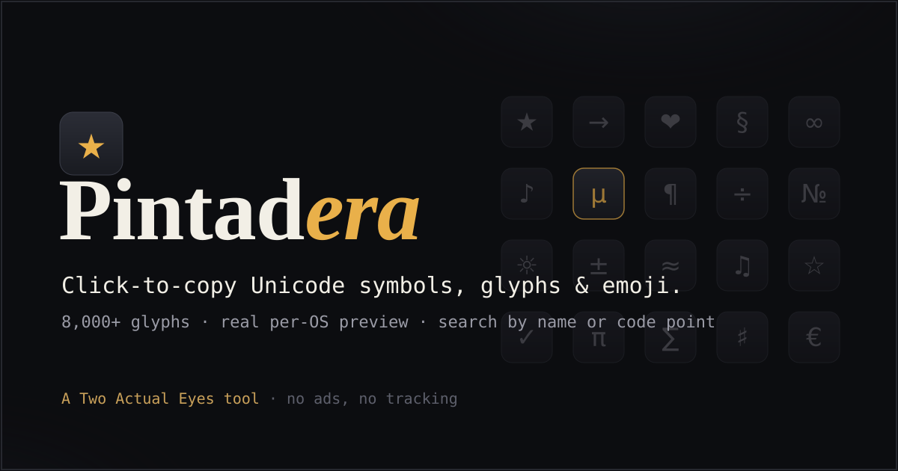

# Stream Deck Symbols

A fast, free, click-to-copy picker for **8,000+ Unicode symbols and emoji** — with per-OS rendering previews so the on-screen glyph predicts how the character will actually look once you paste it. Built to load up a Stream Deck "Symbols" profile, useful anywhere you type.

**Live:** _(deploy and put your URL here)_



## What it does

- **8,389 glyphs** — 6,483 symbols (arrows, math, currency, punctuation, technical/keyboard, shapes, dingbats, Greek, accented Latin, fractions, music, astro, cards, braille, box-drawing…) + 1,906 emoji. CJK, Hangul and other non-Latin scripts are intentionally excluded.
- **Click to copy** any glyph to the clipboard.
- **Search by name** (official Unicode names + common aliases, e.g. `command`, `euro`, `heart`) or by code point (`U+2605`).
- **Per-OS preview** — switch between *This device / Windows / Apple / Google-Android / Twitter-X* to see how a glyph renders on each platform before you use it.
  - Emoji use real per-platform **images** (Apple / Google / Twitter via [emoji-datasource](https://github.com/iamcal/emoji-data) on jsDelivr).
  - Windows uses the native **Segoe** font (the true Windows rendering on a Windows machine); Google/Android uses the **Noto** symbol fonts as a consistent cross-platform line-art reference.
  - **Color-emoji accuracy:** a glyph that becomes a color emoji in rich contexts (email, web) previews as that emoji — not a monochrome line-art silhouette. Text-default-but-emoji-capable glyphs (❤ ✂ ✈ …) are marked with a small amber dot.
- **Configurable page size** — 30 (mirrors one physical XL page), 60, 120, or All.
- **Select → Export for Stream Deck** — turn on *Select*, tap the glyphs you want, then *Export* to get either a ready-to-paste **Claude Code prompt** (drives the Stream Deck MCP to build the profile) or raw **JSON**. Pages are sized to 30 glyphs, reserving the two bottom corners of each XL page for Back + Next.
- Responsive, keyboard-accessible (roving-tabindex grid, arrow-key navigation, per-key `aria-label`, live "copied" announcements), dark control-surface design. No backend, no tracking.

## Files

| File | Purpose |
|------|---------|
| `index.html` | The entire app (HTML + CSS + JS). The only file a visitor loads, besides `symbols-data.js`. |
| `symbols-data.js` | Generated dataset — `window.SD_DATA = {…}`. ~525 KB (gzips small). |
| `symbols-data.json` | Same payload as JSON (for inspection / reuse). |
| `generate-data.mjs` | Regenerates the dataset from the Unicode files + `emoji-datasource`. |
| `data/` | Unicode Character Database source files (UnicodeData, Blocks, emoji-data…). |
| `.claude/launch.json` | Local static-server configs for the preview tooling. |

> The deployable artifact is just **`index.html` + `symbols-data.js`** (and optionally an `og-image.png`). Everything else is build/source.

## Run locally

It's a static site — any file server works. From this folder:

```bash
python -m http.server 8000      # → http://localhost:8000/
# or:  npx serve .
```

(You can also just open `index.html` directly — `symbols-data.js` is loaded as a classic `<script src>`, which works over `file://`. Per-platform emoji *images* need a network connection; offline, they fall back to your system emoji font.)

## Regenerate the dataset

The dataset is generated programmatically from official Unicode data so it stays comprehensive and the names power search.

```bash
npm install                  # installs emoji-datasource (JSON only, no images)
# refresh the source files (optional — they're committed under data/):
curl -o data/UnicodeData.txt              https://www.unicode.org/Public/UCD/latest/ucd/UnicodeData.txt
curl -o data/Blocks.txt                   https://www.unicode.org/Public/UCD/latest/ucd/Blocks.txt
curl -o data/emoji-data.txt               https://www.unicode.org/Public/UCD/latest/ucd/emoji/emoji-data.txt
curl -o data/emoji-variation-sequences.txt https://www.unicode.org/Public/UCD/latest/ucd/emoji/emoji-variation-sequences.txt

node generate-data.mjs       # → rewrites symbols-data.js + symbols-data.json
```

To change which Unicode blocks are included or how they're grouped into folders, edit `BLOCK_FOLDER`, `FOLDERS`, and `refine()` in `generate-data.mjs`.

## Deploy (static, no build)

### Cloudflare Pages — drag & drop
1. Put `index.html`, `symbols-data.js` (and an `og-image.png` if you have one) in a folder.
2. Cloudflare dashboard → **Workers & Pages → Create application → Pages → Upload assets**.
3. Name the project (e.g. `streamdeck-symbols`), drag the folder in, **Deploy site**.
4. Live at `https://<project>.pages.dev`.

### Cloudflare Pages — Wrangler CLI
```bash
npx wrangler login
npx wrangler pages deploy . --project-name streamdeck-symbols
```

### GitHub Pages
Push `index.html` + `symbols-data.js` to a repo, then **Settings → Pages → Deploy from a branch → main / root**. Served at `https://<user>.github.io/<repo>/`.

**After deploying:** update `<link rel="canonical">` and the `og:url` / `og:image` / `twitter:image` URLs in `index.html` `<head>` to your real domain so social cards and SEO resolve. Clipboard copy needs HTTPS (a secure context) — every `*.pages.dev` / `github.io` / custom domain serves HTTPS, so it works in production.

## Building the Stream Deck profile

1. Open the tool, turn on **Select**, pick your glyphs (across any folders), click **Export**.
2. Copy the **Claude Code prompt** (it embeds the JSON).
3. Paste it into Claude Code with the [streamdeck-mcp](https://github.com/verygoodplugins/streamdeck-mcp) connected. It confirms your XL, creates the *Symbols Profile* with one folder per group, paged at 30 keys, and puts a **System ▸ Text** action on every key that types the glyph (with the glyph as the key title). The two bottom corners of each page are wired to Back / Next.

## Credits

Character data from the [Unicode Character Database](https://www.unicode.org/); emoji metadata and preview images from [emoji-datasource](https://github.com/iamcal/emoji-data); cross-platform line-art reference uses Google [Noto](https://fonts.google.com/noto) symbol fonts. Display type [Fraunces](https://fonts.google.com/specimen/Fraunces), UI type [JetBrains Mono](https://www.jetbrains.com/lp/mono/).
